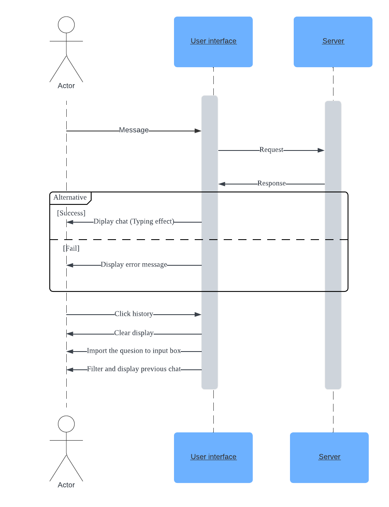
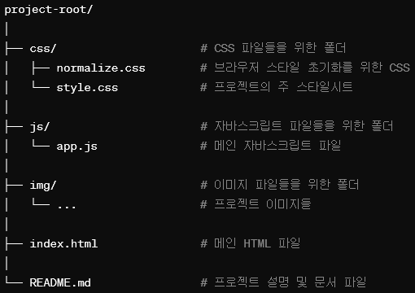
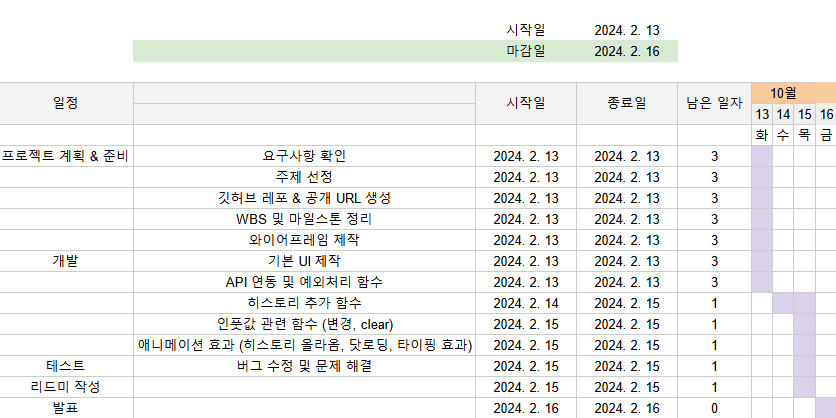
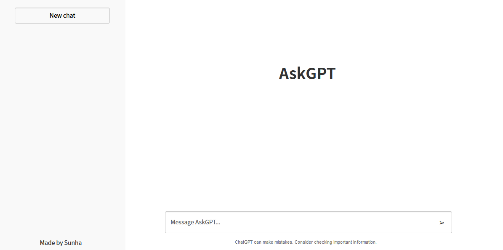
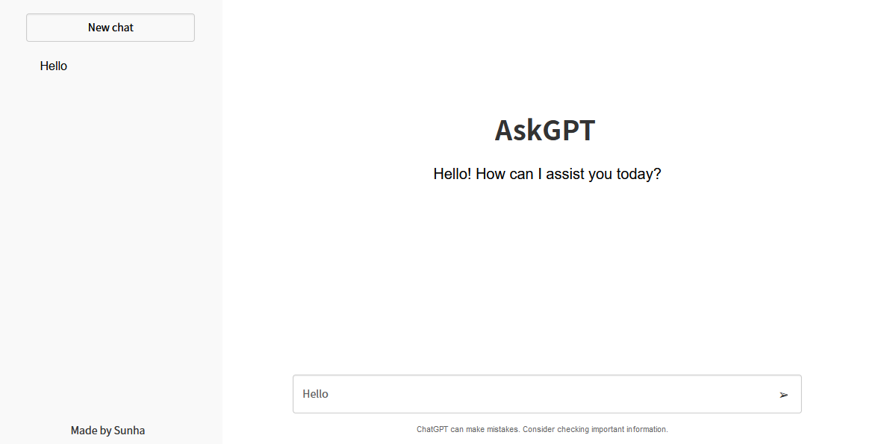
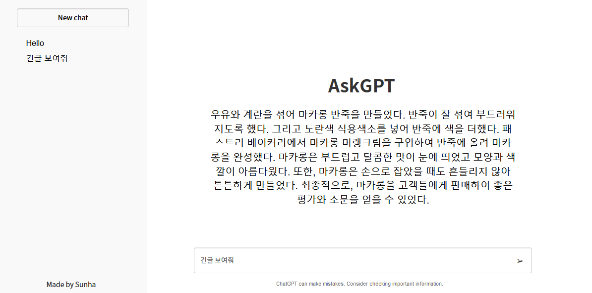
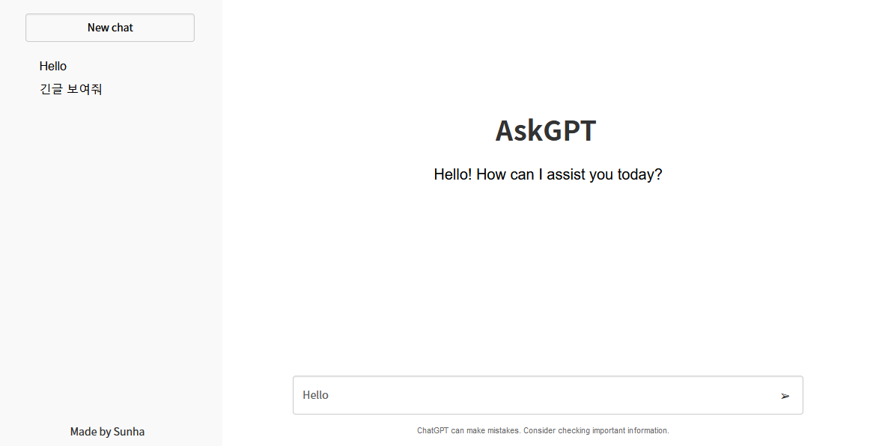
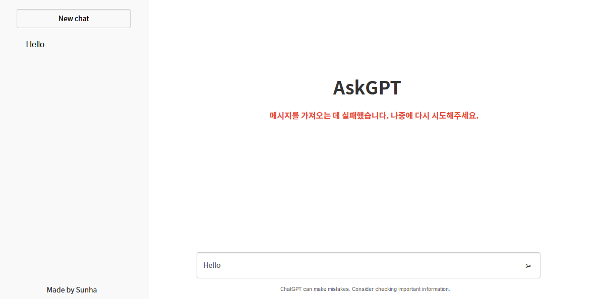
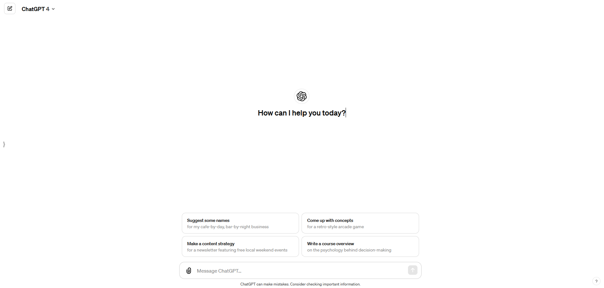

# JavaScript ChatGPT Clone - AskGPT
이 프로젝트는 OpenAI의 ChatGPT를 모방하여 만든 간단한 대화형 웹 애플리케이션입니다. 사용자는 텍스트 메시지를 입력하고, 인공 지능 기반의 응답을 받을 수 있습니다. 이 클론은 웹 기술인 HTML, CSS, 및 JavaScript를 사용하여 구현되었습니다.

## 프로젝트 특징
* 사용자로부터 텍스트 입력 받기
* chatGPT의 API를 사용하여 응답 생성
* 대화 히스토리 관리 및 표시
* 타이핑 효과, 닷로딩 등을 추가하여 사용자 경험 개선

## 사용방법
* AskGPT 사이트에 접속하여 입력 창에 질문을 입력합니다.
* Enter 키를 누르면 클론이 응답을 생성하고 표시됩니다.
* 왼쪽 사이드바에는 입력값 히스토리가 있어 클릭시 이전에 주고 받은 대화 내용을 확인할 수 있습니다.

## 서비스 URL 정보
* 실행 URL: https://sunha-shin.github.io/javascript-chatgpt-clone/src/index.html
* github repository: https://github.com/sunha-shin/javascript-chatgpt-clone
    

## 기존 GitHub 블로그와 비교
* 접근성 및 설치 용이성: GitHub에서 바로 fork 및 사용 가능 및 패키지 설치과정 X, 로그인X
* 커스터마이징의 용이성: HTML, CSS, JavaScript를 사용한 간단한 구조로 쉬운 맞춤 설정 제공
* 단순화된 구조: 복잡한 백엔드나 추가 서버 설정 없이 프론트엔드 기술만으로 구현

## 기능 명세 (Sequence Diagram)

## 파일 구조

## WBS

## 화면 정의서
  * 기본화면 
  

  * 질문 입력시 답변 및 히스토리 생성
    
    

  * 이전 질문 클릭 시 히스토리 생성 X
    

  * 응답 오류시
   

## 참고
  * https://chat.openai.com/ 스타일을 참고  
  
    

## 트러블슈팅 히스토리
**API call 에러코드 429 문제**
   - 개인 key를 사용해서 api call 요청시 크레딧이 부족할 경우 응답이 제한됨. 외부 URL을 사용해서 call 요청하여 해결.  

**이전 질문 클릭 후 새로 질문 입력 시 히스토리에 반영 X**
   - 처음에는 전역변수 flag의 true/false 상태에 따라 히스토리에 추가할지 말지를 정하려고 했으나 로직이 복잡하여 제거
   - 대신 historyElementCreator() 함수 내에서 기능 분리
   - if문을 사용하여 지난 응답값을 관리하여 배열에서 클릭한 질문의 응답을 찾은 후 화면에 보여주는 함수 추가
   - submit버튼 클릭이나 엔터시에만 historyElement에 입력한 것을 append하는 함수 추가 

**try/catch 에러**
   - getMessage 함수 내에서 api 통신을 한 부분에서 오류가 발생하여 화면에 오류메세지와 올바른 응답이 같이보임
   - api 통신은 성공적이었으나 try문 안에서 비동기 통신 후 불러온 함수 내에서 오타가 있어서 이것을 에러로 잡고 에러메세지를 내보냄
   - 오타수정하니 오류메세지 안보이게 해결 

## What I learned
   - 시간 내에 주어진 task를 끝내는 것이 중요! -> 시간을 더 들여서 좋은 코드를 만드려고 하기보다는 아주 간단하게라도 나에게 주어진 일을 끝내는 것이 우선. 아주 간단한 기능이라도 작동하게 하려면 신입은 시간이 걸린다는 것을 명심!!
   - 한 함수당 한가지 기능만 -> 로직이 꼬이지 않음. 유지보수 용이!
   - if문 사용&중첩 -> early return 방법으로, 함수가 특정 조건을 만족하지 않을 때 빠르게 종료되도록 하여 중첩된 조건문을 피할 수 있어 가독성이 더 좋고 로직 이해가 용이함. ex.clickHistoryChild
